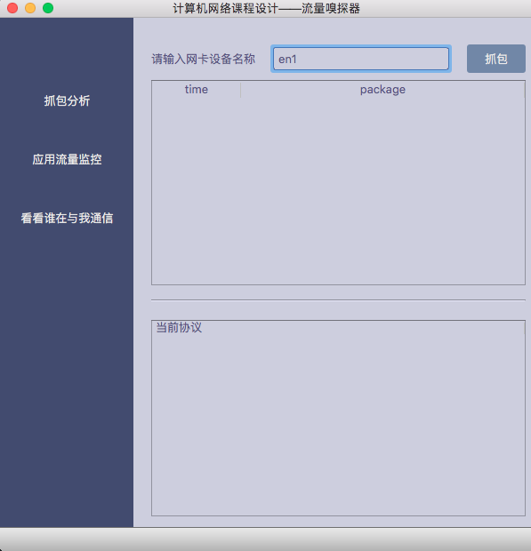
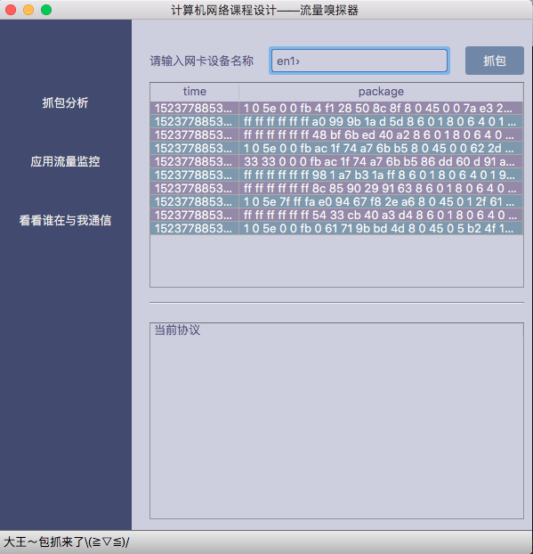
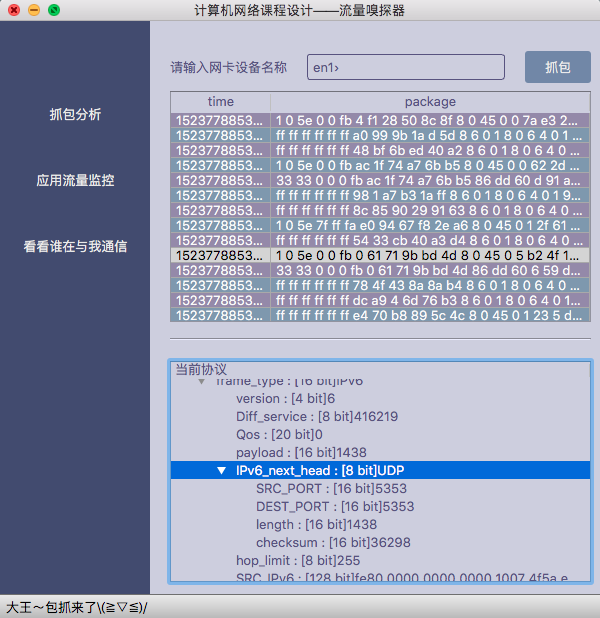
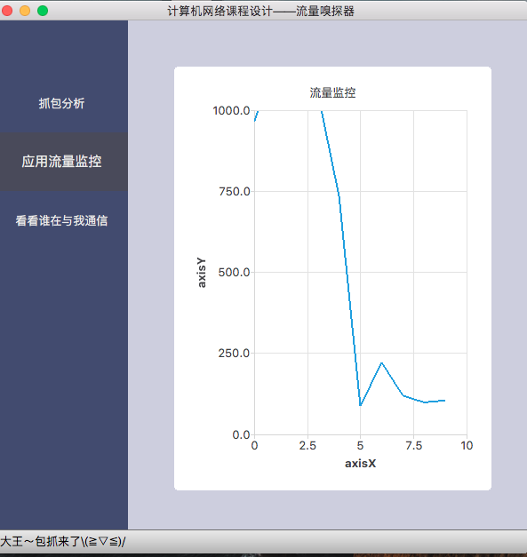
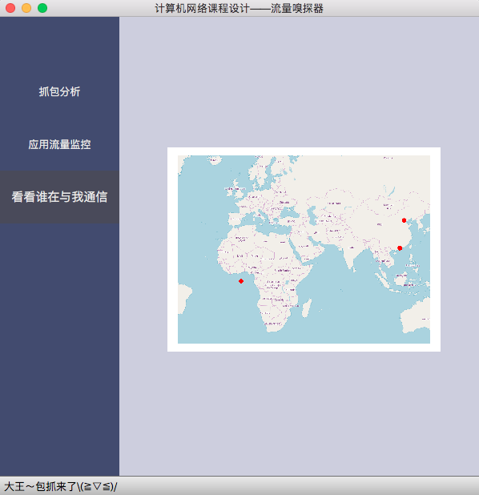

# Sniffer

My homework sniffer using pypcap, pyqt5, smopy, matplotlib 

⚠️ maybe compatible in macOS


## support

You could use pip3 to config your environment

```shell
pip3 install -r requirements.txt
```


## to use

enter sniffer , in your iterm

```shell
sudo python3 window.py
```

It need the root authority


## sample

You may use 'arp -a' to get your NIC information

```shell
arp -a
```


**input your NIC name**




**capture the packages**




**you could see some information**




**check the flow **



**get IP geo. information**

